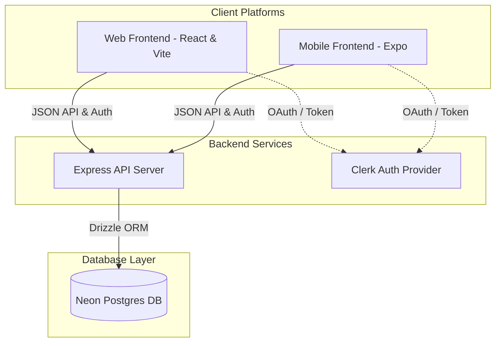

# 🍳 Web & Mobile Integrated Recipe App

이 프로젝트는 **Node.js (Express)** 백엔드를 공유하며, **React (Vite)** 기반의 웹 서비스와 **Expo (React Native)** 기반의 모바일 앱 서비스를 모두 지원하는 통합 레시피 탐색 및 관리 애플리케이션입니다.

**TheMealDB API**를 연동하여 전 세계의 수많은 레시피 데이터를 실시간으로 탐색하고, 사용자가 즐겨찾는 레시피를 데이터베이스에 안전하게 영구 저장할 수 있습니다. Clerk 인증 솔루션을 활용해 웹과 모바일 플랫폼 간에 매끄럽게 사용자 세션과 즐겨찾기 데이터를 실시간으로 동기화합니다.

---

<a id="toc"></a>
## 📌 목차 (Table of Contents)
1. [🛠️ 기술 스택 (Technology Stack)](#technology-stack)
2. [📁 디렉토리 구조 (Directory Structure)](#directory-structure)
3. [🎬 서비스 시나리오 및 핵심 기능](#service-scenarios)
4. [💻 실행 및 설정 방법 (Getting Started)](#getting-started)
5. [⚡ 프로젝트 핵심 최적화 및 강점 (Performance Optimizations)](#performance-optimizations)
6. [📄 기타 연동 가이드 참고](#other-guides)

---

<a id="technology-stack"></a>
## 🛠️ 기술 스택 (Technology Stack)



### 💻 웹 프런트엔드 (Web Frontend)
* **Framework**: [React](https://react.dev/) v19 & [Vite](https://vite.dev/) v8 (초고속 HMR 및 최적화 빌드)
* **Routing**: [React Router](https://reactrouter.com/) v7 (선언적 라우팅 및 중첩 레이아웃)
* **인증 (Authentication)**: [Clerk React](https://clerk.com/docs/references/react/overview) (`@clerk/clerk-react`를 통한 유저 세션 관리)
* **State Management**: [Zustand](https://zustand.docs.pmnd.rs/) v5 (가볍고 직관적인 전역 상태 관리)
* **스타일링 (Styling)**: [Tailwind CSS](https://tailwindcss.com/) v4 (Utility-First CSS 프레임워크) 및 [Lucide React](https://lucide.dev/) 아이콘

### 📱 모바일 프런트엔드 (Mobile Frontend)
* **Framework**: [Expo](https://expo.dev/) (React Native) v54 (최신 에코시스템 반영)
* **Routing**: [Expo Router](https://docs.expo.dev/router/introduction/) (파일 기반 라우팅)
* **인증 (Authentication)**: [Clerk Expo](https://clerk.com/docs/quickstarts/expo) (`@clerk/expo` & `expo-secure-store` 토큰 암호화 캐싱)
* **State Management**: React Native Local State & Module-level caching (Zustand 연동 가능 구조)
* **스타일링 (Styling)**: React Native StyleSheet, [Ionicons](https://ionicons.com/) 벡터 아이콘
* **피드백/인터랙션**: `expo-haptics` (햅틱 진동 피드백)
* **성능 최적화**: 
  * `expo-image` (초고속 하이브리드 캐싱, BlurHash 플레이스홀더, 이미지 페이드인 및 렌더링 최적화)
  * `FlatList 성능 튜닝` (메모리 클리핑, 배치 렌더링 크기 및 윈도우 버퍼 최적화)
  * `탭 상태 캐싱` (상세 화면으로 갔다가 돌아왔을 때 이전 카테고리 상태 유지)

### ⚙️ 백엔드 (Backend)
* **Runtime**: Node.js (ES Modules)
* **Framework**: Express.js (Express 5.x의 비동기 에러 바운싱 활용)
* **Database**: [Neon Postgres](https://neon.tech/) (Serverless PostgreSQL Cloud)
* **ORM**: [Drizzle ORM](https://orm.drizzle.team/) & [Drizzle Kit](https://orm.drizzle.team/kit-docs/overview) (Schema-first 개발 및 마이그레이션)
* **인증 미들웨어**: `@clerk/express` (Clerk Auth API 토큰 검증 및 유저 컨텍스트 주입)
* **호스팅**: [Render.com](https://render.com/) (자동 휴면 방지 Self-Ping CronJob 내장)

[⬆️ 목차로 돌아가기](#toc)

---

<a id="directory-structure"></a>
## 📁 디렉토리 구조 (Directory Structure)

```text
project/
 ├─ .vscode/                   # VS Code 워크스페이스 전역 설정
 │   └─ settings.json          # cSpell 경고 전역 비활성화 등 설정 파일
 ├─ backend/                   # Node.js Express 백엔드 소스 폴더
 │   ├─ .vscode/
 │   │   └─ settings.json      # 백엔드 전용 VS Code 설정 (cSpell 비활성화)
 │   ├─ src/
 │   │   ├─ config/
 │   │   │   ├─ cron.js        # Render.com 서버 휴면 방지 Cron 설정
 │   │   │   ├─ db.js          # Drizzle ORM 및 Neon Database 연결
 │   │   │   └─ env.js         # 환경 변수 스키마 정의
 │   │   ├─ controllers/
 │   │   │   └─ favorite.controller.js # 즐겨찾기 CRUD 컨트롤러
 │   │   ├─ db/
 │   │   │   ├─ migrations/    # Drizzle Kit으로 자동 생성된 SQL 마이그레이션 파일들
 │   │   │   └─ schema.js      # Drizzle PostgreSQL DB 스키마 정의
 │   │   ├─ middleware/
 │   │   │   └─ error.middleware.js # Express 5.x 전역 에러 핸들링 미들웨어
 │   │   ├─ routes/
 │   │   │   └─ favorite.route.js # 즐겨찾기 관련 API 라우팅 정의
 │   │   └─ server.js          # Express 서버 엔트리 포인트
 │   ├─ package.json
 │   └─ .env                   # DB 연결 및 배포 설정 환경변수
 │
 ├─ frontend/                  # React 웹 프런트엔드 소스 폴더
 │   ├─ .vscode/
 │   │   └─ settings.json      # 프런트엔드 전용 VS Code 설정 (cSpell 비활성화)
 │   ├─ src/
 │   │   ├─ assets/            # 로고 및 정적 이미지 리소스
 │   │   ├─ components/        # 재사용 웹 컴포넌트 (Header, RecipeCard 등)
 │   │   ├─ pages/             # 웹 페이지 컴포넌트 (Home, Search, Favorites, Detail, Auth 등)
 │   │   ├─ services/          # API 통신 로직 (TheMealDB API 래퍼 및 캐싱)
 │   │   ├─ store/             # Zustand 전역 상태 저장소 (즐겨찾기 상태 관리)
 │   │   ├─ App.jsx            # 라우팅 및 ClerkProvider 통합 구조 정의
 │   │   ├─ App.css            # 웹 전용 스타일 시트
 │   │   ├─ index.css          # 글로벌 Tailwind CSS v4 스타일 파일
 │   │   └─ main.jsx           # React 애플리케이션 시작점
 │   ├─ index.html
 │   ├─ vite.config.js         # Vite 빌드 및 Tailwind 플러그인 설정
 │   ├─ package.json
 │   └─ .env                   # Clerk API 키 및 백엔드 서버 URL 환경변수
 │
 ├─ mobile/                    # Expo 모바일 프런트엔드 소스 폴더
 │   ├─ .vscode/
 │   │   └─ settings.json      # 모바일 전용 VS Code 설정 (cSpell 비활성화 및 저장 액션)
 │   ├─ app/                   # Expo Router 파일 기반 라우팅 경로
 │   │   ├─ (auth)/            # 비로그인 사용자용 경로 (Sign-In, Sign-Up)
 │   │   ├─ (tabs)/            # 하단 탭 레이아웃 (Home, Search, Favorites)
 │   │   ├─ recipe/
 │   │   │   └─ [id].jsx       # 레시피 상세 화면 (Dynamic Route)
 │   │   └─ _layout.tsx        # 최상위 루트 레이아웃 (Clerk Provider 바인딩)
 │   ├─ assets/                # 정적 리소스 및 공통 CSS/Style 파일
 │   ├─ components/            # 재사용 가능 UI 컴포넌트
 │   │   ├─ HomeHeader.jsx     # 홈 상단 영역 및 카테고리 필터 슬라이더
 │   │   ├─ HomeFooter.jsx     # FlatList 하단 인디케이터
 │   │   ├─ RecipeItem.jsx     # 그리드 카드 형태의 레시피 썸네일 컴포넌트
 │   │   ├─ LatestRecipe.jsx   # 홈 화면 추천 레시피 배너
 │   │   └─ SafeScreen.jsx     # SafeAreaView 컴포넌트 wrapper
 │   ├─ constants/             # 색상, API URL 등의 상수 정의
 │   ├─ services/              # API 통신 로직 및 데이터 어댑터
 │   │   ├─ mealAPI.js         # TheMealDB API 통신 및 메모리 캐싱 레이어
 │   │   └─ tokenCache.ts      # Clerk 로그인 토큰 SecureStore 캐싱
 │   ├─ package.json
 │   └─ .env                   # Clerk API Key 및 API URL 설정 환경변수
 │
 ├─ README.md                  # 프로젝트 통합 설명서 (현재 파일)
 ├─ postgreDb.md               # 데이터베이스 연동 가이드 문서
 ├─ clerkAuth.md               # 사용자 인증 설정 가이드 문서
 └─ renderOngoing.md           # Render.com 무료 티어 서버 활성 가이드 문서
```

[⬆️ 목차로 돌아가기](#toc)

---

<a id="service-scenarios"></a>
## 🎬 서비스 시나리오 및 핵심 기능

### Scenario 1. 회원가입 및 로그인 (Clerk Authentication Gate)
1. **인증 가드 (Authentication Guard)**: 
   * **웹**: 로그인하지 않은 경우 자동으로 `/sign-in` 경로로 리다이렉트되어 전체 페이지 접근이 통제됩니다.
   * **모바일**: Clerk의 `<Show>` 컴포넌트와 Expo Router가 결합하여 비로그인 사용자 흐름을 제한하고 `(auth)/sign-in`으로 강제 이동시킵니다.
2. **이메일 인증**: 계정 생성 시 Clerk Auth에 의해 입력된 이메일로 6자리 보안 인증 코드가 즉각 발송됩니다. 해당 코드를 인증 완료하면 계정 활성화가 끝납니다.
3. **토큰 영구 저장**:
   * **웹**: 브라우저의 Secure Cookie 및 LocalStorage 영역을 사용해 브라우저를 닫아도 세션을 유지합니다.
   * **모바일**: iOS Keychain 및 Android Keystore를 내부적으로 사용하는 `expo-secure-store`에 액세스 토큰을 암호화 캐싱하여 재실행 시 로그인 상태를 유지합니다.

### Scenario 2. 플랫폼 연동 레시피 탐색 (Recipe Home)
1. **추천 레시피 배너**: 당일의 엄선된 추천 요리 배너가 화면 최상단에 미려하게 렌더링되며, `priority="high"` 설정으로 딜레이 없는 즉시 로딩이 이뤄집니다.
2. **카테고리 퀵 필터**: 
   * **웹**: 상단 탭 혹은 사이드 카테고리를 활용해 비프, 치킨, 디저트 등 카테고리를 부드럽게 새로고침 없이 탐색합니다.
   * **모바일**: `LayoutAnimation`이 내장된 카테고리 아이콘 슬라이더를 탭하여 리스트를 유려한 전환 애니메이션과 함께 필터링합니다.
3. **이전 카테고리 기억 및 복원 (탭 상태 보존)**:
   * 모바일 홈에서 특정 카테고리를 선택한 후 레시피 상세페이지에 다녀왔을 때, 이전 카테고리 선택 상태가 유지되도록 모듈 범위 메모리 변수(`lastSelectedCategory`)에 캐싱하여 사용성을 크게 증대시켰습니다.
4. **무한 스크롤 및 고성능 2열 그리드**: 
   * 스크롤을 내릴 때마다 다음 페이지의 레시피 목록을 가져오며, `FlatList` 렌더링 파라미터를 조율하여 메모리 낭비를 줄이고 부드러운 스크롤을 제공합니다.

### Scenario 3. 디바운스 적용 스마트 검색 (Search & Discovery)
1. **검색 전 무작위 추천**: 검색어를 입력하기 전에는 사용자에게 무작위 6개(웹은 확장 가능)의 다채로운 레시피 카드 리스트를 무작위 추천합니다.
2. **입력 디바운싱 (Debounce Search)**: 요리사명, 재료명(예: `tomato`, `beef`) 검색 창 입력 완료 후 600ms 동안 추가 입력이 없으면 검색 API를 트리거하여, 불필요하게 서버에 빈번한 쿼리 요청이 전송되지 않도록 방지합니다.

### Scenario 4. 직관적인 요리 가이드 상세 (Recipe Detail)
1. **체크리스트형 식재료 준비**: 해당 레시피에 소요되는 재료 및 계량 정보를 제공하며, 장을 보거나 손질이 완료된 재료를 체크박스 형태로 체크하며 준비할 수 있습니다.
2. **단계별 카드형 지침**: 방대하고 가독성이 떨어지는 레시피 원문 텍스트를 `\r\n` 구분자로 파싱하여 각각 순번이 매겨진 깔끔한 '단계별 지침 카드(Step Card)' 레이아웃으로 변경해 가독성을 크게 개선했습니다.
3. **유튜브 튜토리얼 연동**: 외부 링크 또는 비디오 연결 버튼을 터치하여 요리 과정을 생생한 영상으로 편리하게 참고할 수 있습니다.

### Scenario 5. 나만의 레시피 수첩 및 동기화 (Favorites & Stats)
1. **크로스 플랫폼 실시간 동기화**: 모바일 앱에서 즐겨찾기에 등록한 요리 데이터는 백엔드 PostgreSQL DB를 경유하여, 웹 브라우저에서 동일 계정으로 로그인했을 때 즉각 연동되어 목록에 표시됩니다.
2. **개인 건강/요리 통계 대시보드**: 
   * 사용자가 현재까지 등록한 즐겨찾기 요리의 총 개수와 저장된 모든 요리들의 **평균 조리 시간(Avg. Cook Time)**을 분석해 주는 세련된 통계 카드 레이아웃이 제공됩니다.
   * 즐겨찾기 해제 시 상단 통계 수치가 실시간으로 리계산되어 UI 컴포넌트에 즉각 반영됩니다.
   * 모바일에서는 하트 아이콘 토글 시 `expo-haptics`를 통한 가벼운 진동(Haptic Feedback)이 동반되어 실감 나는 피드백을 줍니다.

[⬆️ 목차로 돌아가기](#toc)

---

<a id="getting-started"></a>
## 💻 실행 및 설정 방법 (Getting Started)

### 📋 Prerequisites
* **Node.js** v18 이상 설치 완료
* **Neon Postgres** 계정 및 데이터베이스 연결 주소 (`DATABASE_URL`) 준비
* **Clerk** 계정 및 Publishable Key 발급 필요

---

### 1. Backend 설정 및 실행

1. 백엔드 폴더로 이동합니다.
   ```bash
   cd backend
   ```
2. 필요 라이브러리 패키지를 한 번에 설치합니다.
   ```bash
   npm install
   ```
3. `backend/.env` 파일을 생성하고 아래 내용을 환경에 맞춰 정의합니다.
   ```env
   PORT=3000
   DATABASE_URL=your_neon_postgresql_connection_string
   NODE_ENV=development
   API_URL=http://localhost:3000/api
   ```
4. Drizzle Kit을 사용해 정의된 DB 스키마를 Neon Cloud DB에 즉시 동기화(Push)합니다.
   ```bash
   npx drizzle-kit push
   ```
5. 개발 서버를 핫 리로드 기능과 함께 실행합니다.
   ```bash
   npm run dev
   ```

---

### 2. Web Frontend 설정 및 실행

1. 프론트엔드 폴더로 이동합니다.
   ```bash
   cd frontend
   ```
2. 필요 패키지를 설치합니다.
   ```bash
   npm install
   ```
3. `frontend/.env` 파일을 새로 생성하고 아래 환경 변수 값을 정의합니다.
   ```env
   VITE_CLERK_PUBLISHABLE_KEY=your_clerk_publishable_key_here
   VITE_API_URL=http://localhost:3000/api
   ```
4. Vite 로컬 웹 개발 서버를 구동합니다.
   ```bash
   npm run dev
   ```
5. 웹 브라우저를 통해 `http://localhost:5173` 경로로 접속하여 정상 동작을 확인합니다.

---

### 3. Mobile Frontend 설정 및 실행

1. 모바일 폴더로 이동합니다.
   ```bash
   cd mobile
   ```
2. 모바일 Expo 패키지 의존성을 설치합니다.
   ```bash
   npm install
   ```
3. `mobile/.env` 파일을 만들고 Clerk 키를 등록합니다.
   ```env
   EXPO_PUBLIC_CLERK_PUBLISHABLE_KEY=your_clerk_publishable_key_here
   ```
4. 백엔드 API와의 실시간 데이터 통신을 위해 `mobile/constants/api.js` 파일 내 `API_URL` 상수를 본인의 컴퓨터 로컬 IP주소로 설정해 줍니다.
   *(스마트폰 실기기 테스트 시 localhost 주소로는 로컬 백엔드 서버에 접근할 수 없습니다.)*
   ```javascript
   export const API_URL = "http://YOUR_LOCAL_COMPUTER_IP:3000/api";
   ```
5. Expo 번들러 클라이언트를 시작합니다.
   ```bash
   npx expo start
   ```
6. 터미널에 노출되는 QR 코드를 테스트 스마트폰(Expo Go 앱 설치 필요) 카메라로 스캔하거나 시뮬레이터를 켜고 구동합니다.

[⬆️ 목차로 돌아가기](#toc)

---

<a id="performance-optimizations"></a>
## ⚡ 프로젝트 핵심 최적화 및 강점 (Performance Optimizations)

> [!TIP]
> **성능 및 UX 최적화 요약**
> * **하이브리드 캐싱 (`expo-image`)**: 모바일 앱에 고성능 이미지 캐싱 라이브러리를 바인딩하고 `cachePolicy="memory-disk"` 설정을 명시해, 네트워크 상황에 구애받지 않는 안정적인 화면 로딩을 보장합니다.
> * **부드러운 페이드 인 및 로딩 플레이스홀더**: 이미지가 다운로드되는 동안 미려한 `BlurHash` 플레이스홀더를 노출하고 `transition={200}` 이상을 주어 딱딱한 깜빡임 없는 고급스러운 렌더링 UX를 구현했습니다.
> * **FlatList 렌더링 리소스 제한**: 대량의 리스트 스크롤 시 생기는 프레임 드랍을 막기 위해 `initialNumToRender={6}`, `windowSize={5}` 등을 조율하고 화면 밖 아이템의 뷰포트 클리핑(`removeClippedSubviews`) 및 `recyclingKey` 바인딩을 적용해 메모리 누수를 극대화하여 차단했습니다.
> * **메모리 API 캐시 (In-Memory Cache Map)**: 레시피 목록, 상세 데이터, 카테고리 정보에 인메모리 캐시 맵(`Map`)을 적용해 화면 재진입 시 네트워크 통신 비용을 줄였습니다.
> * **렌더링 오버헤드 방지**: 웹과 모바일의 스크롤 시 불필요한 리렌더링을 차단하기 위해 `React.memo` 및 `useCallback`을 적극 활용하여 프레임 드랍을 사전에 차단했습니다.
> * **Drizzle Serverless Query**: Neon Postgres 연결 시 HTTP 드라이버인 `@neondatabase/serverless`를 활용하여 TCP Connection Pooling 비용을 절감하고, Cold Start 응답 속도를 크게 개선했습니다.
> * **전역적 미들웨어 바운싱**: 백엔드 내부의 보일러플레이트 구조였던 모든 비즈니스 로직 try-catch를 지양하고 Express 5.x의 에러 위임 기능을 사용해 무중단 안정적 서비스를 보장합니다.

[⬆️ 목차로 돌아가기](#toc)

---

<a id="other-guides"></a>
## 📄 기타 연동 가이드 참고
데이터베이스나 인증 솔루션 설정에 관한 보다 세분화된 문서는 프로젝트 루트의 아래 개별 가이드에서 자세히 확인할 수 있습니다.
* 🗄️ 데이터베이스 스키마 및 Neon PostgreSQL 연동법: [postgreDb.md](file:///Users/guniluk/Desktop/CLI/webMobile-recipe-all/postgreDb.md)
* 🔐 Clerk Auth Expo & Web 상세 인증 설정법: [clerkAuth.md](file:///Users/guniluk/Desktop/CLI/webMobile-recipe-all/clerkAuth.md)
* 🌐 Render.com 백엔드 배포 및 항시 활성화 cron 설정법: [renderOngoing.md](file:///Users/guniluk/Desktop/CLI/webMobile-recipe-all/renderOngoing.md)

[⬆️ 목차로 돌아가기](#toc)
