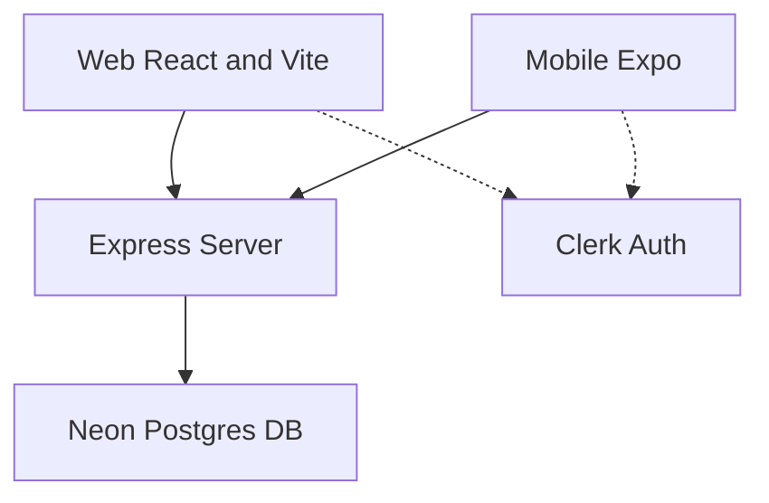

# 🍳 Web & Mobile Integrated Recipe App

이 프로젝트는 **Node.js (Express)** 백엔드를 공유하며, **React (Vite)** 기반의 웹 서비스와 **Expo (React Native)** 기반의 모바일 앱 서비스를 모두 지원하는 통합 레시피 탐색 및 관리 애플리케이션입니다.

**TheMealDB API**를 연동하여 전 세계의 수많은 레시피 데이터를 실시간으로 탐색하고, 사용자가 즐겨찾는 레시피를 데이터베이스에 안전하게 영구 저장할 수 있습니다. Clerk 인증 솔루션을 활용해 웹과 모바일 플랫폼 간에 매끄럽게 사용자 세션과 즐겨찾기 데이터를 실시간으로 동기화합니다.

---

<a id="toc"></a>
## 📌 목차 (Table of Contents)
1. [🛠️ 기술 스택 (Technology Stack)](#technology-stack)
2. [📁 디렉토리 구조 (Directory Structure)](#directory-structure)
3. [🎬 서비스 시나리오 및 핵심 기능](#service-scenarios)
4. [💻 실행 및 설정 방법 (Getting Started)](#getting-started)
5. [⚡ 프로젝트 핵심 최적화 및 강점 (Performance Optimizations)](#performance-optimizations)
6. [🔧 최신 리팩토링 & 개선 이력 (Refactoring & Layout History)](#refactoring-history)
7. [📄 기타 연동 가이드 참고](#other-guides)
8. [🚀 프로젝트 개발 순서 매뉴얼 (Development Manual)](#development-manual)

---

<a id="technology-stack"></a>
## 🛠️ 기술 스택 (Technology Stack)



### 💻 웹 프런트엔드 (Web Frontend)
* **Framework**: [React](https://react.dev/) v19 & [Vite](https://vite.dev/) v8 (초고속 HMR 및 최적화 빌드)
* **Routing**: [React Router](https://reactrouter.com/) v7 (선언적 라우팅 및 중첩 레이아웃)
* **인증 (Authentication)**: [Clerk React](https://clerk.com/docs/references/react/overview) (`@clerk/clerk-react`를 통한 유저 세션 관리)
* **State Management**: [Zustand](https://zustand.docs.pmnd.rs/) v5 (가볍고 직관적인 전역 상태 관리)
* **스타일링 (Styling)**: [Tailwind CSS](https://tailwindcss.com/) v4 (Utility-First CSS 프레임워크) 및 [Lucide React](https://lucide.dev/) 아이콘

### 📱 모바일 프런트엔드 (Mobile Frontend)
* **Framework**: [Expo](https://expo.dev/) (React Native) v54 (최신 에코시스템 반영)
* **Routing**: [Expo Router](https://docs.expo.dev/router/introduction/) (파일 기반 라우팅)
* **인증 (Authentication)**: [Clerk Expo](https://clerk.com/docs/quickstarts/expo) (`@clerk/expo` & `expo-secure-store` 토큰 암호화 캐싱)
* **State Management**: React Native Local State & Module-level caching (Zustand 연동 가능 구조)
* **스타일링 (Styling)**: React Native StyleSheet, [Ionicons](https://ionicons.com/) 벡터 아이콘
* **피드백/인터랙션**: `expo-haptics` (햅틱 진동 피드백)
* **성능 최적화**: 
  * `expo-image` (초고속 하이브리드 캐싱, BlurHash 플레이스홀더, 이미지 페이드인 및 렌더링 최적화)
  * `FlatList 성능 튜닝` (메모리 클리핑, 배치 렌더링 크기 및 윈도우 버퍼 최적화)
  * `탭 상태 캐싱` (상세 화면으로 갔다가 돌아왔을 때 이전 카테고리 상태 유지)

### ⚙️ 백엔드 (Backend)
* **Runtime**: Node.js (ES Modules)
* **Framework**: Express.js (Express 5.x의 비동기 에러 바운싱 활용)
* **Database**: [Neon Postgres](https://neon.tech/) (Serverless PostgreSQL Cloud)
* **ORM**: [Drizzle ORM](https://orm.drizzle.team/) & [Drizzle Kit](https://orm.drizzle.team/kit-docs/overview) (Schema-first 개발 및 마이그레이션)
* **인증 미들웨어**: `@clerk/express` (Clerk Auth API 토큰 검증 및 유저 컨텍스트 주입)
* **호스팅**: [Render.com](https://render.com/) (자동 휴면 방지 Self-Ping CronJob 내장)

[⬆️ 목차로 돌아가기](#toc)

---

<a id="directory-structure"></a>
## 📁 디렉토리 구조 (Directory Structure)

```text
project/
 ├─ .vscode/                   # VS Code 워크스페이스 전역 설정
 ├─ backend/                   # Node.js Express 백엔드 소스 폴더
 │   ├─ src/
 │   │   ├─ config/
 │   │   │   ├─ cron.js        # Render.com 서버 휴면 방지 Cron 설정
 │   │   │   ├─ db.js          # Drizzle ORM 및 Neon Database 연결
 │   │   │   └─ env.js         # 환경 변수 스키마 정의
 │   │   ├─ controllers/
 │   │   │   └─ favorite.controller.js # 즐겨찾기 CRUD 컨트롤러
 │   │   ├─ db/
 │   │   │   ├─ migrations/    # Drizzle Kit으로 자동 생성된 SQL 마이그레이션 파일들
 │   │   │   └─ schema.js      # Drizzle PostgreSQL DB 스키마 정의
 │   │   ├─ middleware/
 │   │   │   └─ error.middleware.js # Express 5.x 전역 에러 핸들링 미들웨어
 │   │   ├─ routes/
 │   │   │   └─ favorite.route.js # 즐겨찾기 관련 API 라우팅 정의
 │   │   └─ server.js          # Express 서버 엔트리 포인트
 │   ├─ package.json
 │   └─ .env                   # DB 연결 및 배포 설정 환경변수
 │
 ├─ frontend/                  # React 웹 프런트엔드 소스 폴더
 │   ├─ src/
 │   │   ├─ assets/            # 로고 및 정적 이미지 리소스
 │   │   ├─ components/        # 재사용 웹 컴포넌트 (Header, RecipeCard 등)
 │   │   ├─ pages/             # 웹 페이지 컴포넌트 (Home, Search, Favorites, Detail 등)
 │   │   ├─ services/          # API 통신 로직 (TheMealDB API 래퍼 및 캐싱)
 │   │   ├─ store/             # Zustand 전역 상태 저장소 (즐겨찾기 상태 관리)
 │   │   ├─ App.jsx            # 라우팅 및 ClerkProvider 통합 구조 정의
 │   │   ├─ App.css            # 웹 전용 스타일 시트
 │   │   ├─ index.css          # 글로벌 Tailwind CSS v4 스타일 파일
 │   │   └─ main.jsx           # React 애플리케이션 시작점
 │   ├─ index.html
 │   ├─ vite.config.js         # Vite 빌드 및 Tailwind 플러그인 설정
 │   ├─ package.json
 │   └─ .env                   # Clerk API 키 및 백엔드 서버 URL 환경변수
 │
 ├─ mobile/                    # Expo 모바일 프런트엔드 소스 폴더
 │   ├─ app/                   # Expo Router 파일 기반 라우팅 경로
 │   │   ├─ (auth)/            # 비로그인 사용자용 경로 (Sign-In, Sign-Up)
 │   │   ├─ (tabs)/            # 하단 탭 레이아웃 (Home, Search, Favorites)
 │   │   ├─ recipe/
 │   │   │   └─ [id].jsx       # 레시피 상세 화면 (Dynamic Route)
 │   │   └─ _layout.tsx        # 최상위 루트 레이아웃 (Clerk Provider 바인딩)
 │   ├─ assets/                # 정적 리소스 및 공통 CSS/Style 파일
 │   ├─ components/            # 재사용 가능 UI 컴포넌트 (RecipeItem, SafeScreen 등)
 │   ├─ constants/             # 색상, API URL 등의 상수 정의
 │   ├─ services/              # API 통신 로직 및 데이터 어댑터 (mealAPI, tokenCache)
 │   ├─ package.json
 │   └─ .env                   # Clerk API Key 및 API URL 설정 환경변수
 ├─ README.md                  # 프로젝트 통합 설명서 (현재 파일)
 ├─ postgreDb.md               # 데이터베이스 연동 가이드 문서
 ├─ clerkAuth.md               # 사용자 인증 설정 가이드 문서
 └─ renderOngoing.md           # Render.com 무료 티어 서버 활성 가이드 문서
```

[⬆️ 목차로 돌아가기](#toc)

---

<a id="service-scenarios"></a>
## 🎬 서비스 시나리오 및 핵심 기능

### Scenario 1. 회원가입 및 로그인 (Clerk Authentication Gate)
1. **인증 가드 (Authentication Guard)**: 
   * **웹**: 로그인하지 않은 경우 자동으로 `/sign-in` 경로로 리다이렉트되어 전체 페이지 접근이 통제됩니다.
   * **모바일**: Clerk의 `<Show>` 컴포넌트와 Expo Router가 결합하여 비로그인 사용자 흐름을 제한하고 `(auth)/sign-in`으로 강제 이동시킵니다.
2. **이메일 인증**: 계정 생성 시 Clerk Auth에 의해 입력된 이메일로 6자리 보안 인증 코드가 즉각 발송됩니다. 해당 코드를 인증 완료하면 계정 활성화가 끝납니다.
3. **토큰 영구 저장**:
   * **웹**: 브라우저의 Secure Cookie 및 LocalStorage 영역을 사용해 브라우저를 닫아도 세션을 유지합니다.
   * **모바일**: iOS Keychain 및 Android Keystore를 내부적으로 사용하는 `expo-secure-store`에 액세스 토큰을 암호화 캐싱하여 재실행 시 로그인 상태를 유지합니다.

### Scenario 2. 플랫폼 연동 레시피 탐색 (Recipe Home)
1. **추천 레시피 배너**: 당일의 엄선된 추천 요리 배너가 화면 최상단에 미려하게 렌더링되며, `priority="high"` 설정으로 딜레이 없는 즉시 로딩이 이뤄집니다.
2. **카테고리 퀵 필터**: 
   * **웹**: 상단 탭 혹은 사이드 카테고리를 활용해 비프, 치킨, 디저트 등 카테고리를 부드럽게 새로고침 없이 탐색합니다.
   * **모바일**: `LayoutAnimation`이 내장된 카테고리 아이콘 슬라이더를 탭하여 리스트를 유려한 전환 애니메이션과 함께 필터링합니다.
3. **이전 카테고리 기억 및 복원 (탭 상태 보존)**:
   * 모바일 홈에서 특정 카테고리를 선택한 후 레시피 상세페이지에 다녀왔을 때, 이전 카테고리 선택 상태가 유지되도록 모듈 범위 메모리 변수(`lastSelectedCategory`)에 캐싱하여 사용성을 크게 증대시켰습니다.
4. **무한 스크롤 및 고성능 2열 그리드**: 
   * 스크롤을 내릴 때마다 다음 페이지의 레시피 목록을 가져오며, `FlatList` 렌더링 파라미터를 조율하여 메모리 낭비를 줄이고 부드러운 스크롤을 제공합니다.

### Scenario 3. 디바운스 적용 스마트 검색 (Search & Discovery)
1. **검색 전 무작위 추천**: 검색어를 입력하기 전에는 사용자에게 무작위 6~8개의 다채로운 레시피 카드 리스트를 무작위 추천합니다.
2. **입력 디바운싱 (Debounce Search)**: 요리명, 재료명(예: `tomato`, `beef`) 검색 창 입력 완료 후 300~600ms 동안 추가 입력이 없으면 검색 API를 트리거하여, 불필요하게 서버에 빈번한 쿼리 요청이 전송되지 않도록 방지합니다.

### Scenario 4. 직관적인 요리 가이드 상세 (Recipe Detail)
1. **체크리스트형 식재료 준비**: 해당 레시피에 소요되는 재료 및 계량 정보를 제공하며, 장을 보거나 손질이 완료된 재료를 체크박스 형태로 체크하며 준비할 수 있습니다.
2. **단계별 카드형 지침**: 방대하고 가독성이 떨어지는 레시피 원문 텍스트를 `\r\n` 구분자로 파싱하여 각각 순번이 매겨진 깔끔한 '단계별 지침 카드(Step Card)' 레이아웃으로 변경해 가독성을 크게 개선했습니다.
3. **유튜브 튜토리얼 연동**: 외부 링크 또는 비디오 연결 버튼을 터치하여 요리 과정을 생생한 영상으로 편리하게 참고할 수 있습니다.

### Scenario 5. 나만의 레시피 수첩 및 동기화 (Favorites & Stats)
1. **크로스 플랫폼 실시간 동기화**: 모바일 앱에서 즐겨찾기에 등록한 요리 데이터는 백엔드 PostgreSQL DB를 경유하여, 웹 브라우저에서 동일 계정으로 로그인했을 때 즉각 연동되어 목록에 표시됩니다.
2. **개인 건강/요리 통계 대시보드**: 
   * 사용자가 현재까지 등록한 즐겨찾기 요리의 총 개수와 저장된 모든 요리들의 **평균 조리 시간(Avg. Cook Time)**을 분석해 주는 세련된 통계 카드 레이아웃이 제공됩니다.
   * 즐겨찾기 해제 시 상단 통계 수치가 실시간으로 리계산되어 UI 컴포넌트에 즉각 반영됩니다.
   * 모바일에서는 하트 아이콘 토글 시 `expo-haptics`를 통한 가벼운 진동(Haptic Feedback)이 동반되어 실감 나는 피드백을 줍니다.

[⬆️ 목차로 돌아가기](#toc)

---

<a id="getting-started"></a>
## 💻 실행 및 설정 방법 (Getting Started)

### 📋 Prerequisites
* **Node.js** v18 이상 설치 완료
* **Neon Postgres** 계정 및 데이터베이스 연결 주소 (`DATABASE_URL`) 준비
* **Clerk** 계정 및 Publishable Key 발급 필요

---

### 1. Backend 설정 및 실행

1. 백엔드 폴더로 이동합니다.
   ```bash
   cd backend
   ```
2. 필요 라이브러리 패키지를 한 번에 설치합니다.
   ```bash
   npm install
   ```
3. `backend/.env` 파일을 생성하고 아래 내용을 환경에 맞춰 정의합니다.
   ```env
   PORT=3000
   DATABASE_URL=your_neon_postgresql_connection_string
   NODE_ENV=development
   API_URL=http://localhost:3000/api
   ```
4. Drizzle Kit을 사용해 정의된 DB 스키마를 Neon Cloud DB에 즉시 동기화(Push)합니다.
   ```bash
   npx drizzle-kit push
   ```
5. 개발 서버를 핫 리로드 기능과 함께 실행합니다.
   ```bash
   npm run dev
   ```

---

### 2. Web Frontend 설정 및 실행

1. 프론트엔드 폴더로 이동합니다.
   ```bash
   cd frontend
   ```
2. 필요 패키지를 설치합니다.
   ```bash
   npm install
   ```
3. `frontend/.env` 파일을 새로 생성하고 아래 환경 변수 값을 정의합니다.
   ```env
   VITE_CLERK_PUBLISHABLE_KEY=your_clerk_publishable_key_here
   VITE_API_URL=http://localhost:3000/api
   ```
4. Vite 로컬 웹 개발 서버를 구동합니다.
   ```bash
   npm run dev
   ```
5. 웹 브라우저를 통해 `http://localhost:5173` 경로로 접속하여 정상 동작을 확인합니다.

---

### 3. Mobile Frontend 설정 및 실행

1. 모바일 폴더로 이동합니다.
   ```bash
   cd mobile
   ```
2. 모바일 Expo 패키지 의존성을 설치합니다.
   ```bash
   npm install
   ```
3. `mobile/.env` 파일을 만들고 Clerk 키를 등록합니다.
   ```env
   EXPO_PUBLIC_CLERK_PUBLISHABLE_KEY=your_clerk_publishable_key_here
   ```
4. 백엔드 API와의 실시간 데이터 통신을 위해 `mobile/constants/api.js` 파일 내 `API_URL` 상수를 본인의 컴퓨터 로컬 IP주소로 설정해 줍니다.
   *(스마트폰 실기기 테스트 시 localhost 주소로는 로컬 백엔드 서버에 접근할 수 없습니다.)*
   ```javascript
   export const API_URL = "http://YOUR_LOCAL_COMPUTER_IP:3000/api";
   ```
5. Expo 번들러 클라이언트를 시작합니다.
   ```bash
   npx expo start
   ```
6. 터미널에 노출되는 QR 코드를 테스트 스마트폰(Expo Go 앱 설치 필요) 카메라로 스캔하거나 시뮬레이터를 켜고 구동합니다.

[⬆️ 목차로 돌아가기](#toc)

---

<a id="performance-optimizations"></a>
## ⚡ 프로젝트 핵심 최적화 및 강점 (Performance Optimizations)

> [!TIP]
> **성능 및 UX 최적화 요약**
> * **하이브리드 캐싱 (`expo-image`)**: 모바일 앱에 고성능 이미지 캐싱 라이브러리를 바인딩하고 `cachePolicy="memory-disk"` 설정을 명시해, 네트워크 상황에 구애받지 않는 안정적인 화면 로딩을 보장합니다.
> * **부드러운 페이드 인 및 로딩 플레이스홀더**: 이미지가 다운로드되는 동안 미려한 `BlurHash` 플레이스홀더를 노출하고 `transition={200}` 이상을 주어 딱딱한 깜빡임 없는 고급스러운 렌더링 UX를 구현했습니다.
> * **FlatList 렌더링 리소스 제한**: 대량의 리스트 스크롤 시 생기는 프레임 드랍을 막기 위해 `initialNumToRender={6}`, `windowSize={5}` 등을 조율하고 화면 밖 아이템의 뷰포트 클리핑(`removeClippedSubviews`) 및 `recyclingKey` 바인딩을 적용해 메모리 누수를 극대화하여 차단했습니다.
> * **메모리 API 캐시 (In-Memory Cache Map)**: 레시피 목록, 상세 데이터, 카테고리 정보에 인메모리 캐시 맵(`Map`)을 적용해 화면 재진입 시 네트워크 통신 비용을 줄였습니다.
> * **렌더링 오버헤드 방지**: 웹과 모바일의 스크롤 시 불필요한 리렌더링을 차단하기 위해 `React.memo` 및 `useCallback`을 적극 활용하여 프레임 드랍을 사전에 차단했습니다.
> * **Drizzle Serverless Query**: Neon Postgres 연결 시 HTTP 드라이버인 `@neondatabase/serverless`를 활용하여 TCP Connection Pooling 비용을 절감하고, Cold Start 응답 속도를 크게 개선했습니다.
> * **전역적 미들웨어 바운싱**: 백엔드 내부의 보일러플레이트 구조였던 모든 비즈니스 로직 try-catch를 지양하고 Express 5.x의 에러 위임 기능을 사용해 무중단 안정적 서비스를 보장합니다.

[⬆️ 목차로 돌아가기](#toc)

---

<a id="refactoring-history"></a>
## 🔧 최신 리팩토링 & 개선 이력 (Refactoring & Layout History)

프로젝트 고도화 및 안정성 향상을 위해 다음과 같은 리팩토링 및 레이아웃 개선이 진행되었습니다:

* **모바일 검색 화면 레이아웃 고도화**:
  * 모바일 검색 페이지에서 검색창과 검색 결과 리스트 사이의 시각적 답답함을 해소하고자 여백(`marginBottom: 20`)을 부여하여 전체적인 디자인 가독성을 크게 개선하였습니다.
* **React 19 및 React Native Hook 렌더링 최적화**:
  * Clerk 인증 훅(`useUser`)에서 제공하는 `user` 객체 자체가 매번 재성성되면서 생기는 불필요한 API 다중 호출 사이드이펙트 및 콘솔 경고를 원천 차단하기 위해, `useEffect` 의존성 배열에 객체 전체 대신 기본형 값인 `user?.id`를 명시적으로 바인딩하도록 전격 수정했습니다. (Favorites, RecipeDetail 등의 메인 화면 적용)
* **런타임 타입 세이프티(Safe Property Access) 보장**:
  * `expo-image` 컴포넌트의 `recyclingKey` 생성 시, `item.id.toString()` 등 존재하지 않는 값에 대한 접근으로 인해 발생할 수 있는 잠재적 런타임 에러 경고를 방어하기 위해 옵셔널 체이닝 및 예외 값에 대응하는 안전한 처리를 구현했습니다.
* **백엔드 설정 일관성 및 로깅 개선**:
  * 백엔드의 Render.com 자동 깨움 스케줄러([cron.js](file:///Users/guniluk/Desktop/CODING/webMobile-recipe-all/backend/src/config/cron.js))에서 개별 `process.env.API_URL`을 직접 호출하던 로직을 공통 환경 설정 파일([env.js](file:///Users/guniluk/Desktop/CODING/webMobile-recipe-all/backend/src/config/env.js))에 정의된 변수로 일원화하고, 설정이 누락되었을 때의 방어 분기 로직을 강화했습니다.

[⬆️ 목차로 돌아가기](#toc)

---

<a id="other-guides"></a>
## 📄 기타 연동 가이드 참고
데이터베이스나 인증 솔루션 설정에 관한 보다 세분화된 문서는 프로젝트 루트의 아래 개별 가이드에서 자세히 확인할 수 있습니다.
* 🗄️ 데이터베이스 스키마 및 Neon PostgreSQL 연동법: [postgreDb.md](file:///Users/guniluk/Desktop/CODING/webMobile-recipe-all/postgreDb.md)
* 🔐 Clerk Auth Expo & Web 상세 인증 설정법: [clerkAuth.md](file:///Users/guniluk/Desktop/CODING/webMobile-recipe-all/clerkAuth.md)
* 🌐 Render.com 백엔드 배포 및 항시 활성화 cron 설정법: [renderOngoing.md](file:///Users/guniluk/Desktop/CODING/webMobile-recipe-all/renderOngoing.md)

[⬆️ 목차로 돌아가기](#toc)

---

<a id="development-manual"></a>
## 🚀 프로젝트 개발 순서 매뉴얼 (Development Step-by-Step Manual)

본 레시피 애플리케이션을 바닥부터 점진적으로 개발하는 과정을 **백엔드(Backend)**, **웹(Web)**, **모바일(Mobile)**로 분리하여 각 순서에 맞게 구체적으로 기술한 가이드라인입니다.

---

### ⚙️ 1부: [공통] 백엔드 및 데이터베이스(Database) 구축 순서
프론트엔드 플랫폼(웹 및 모바일)이 공통의 사용자 데이터를 저장 및 동기화할 수 있도록 API 서버를 가장 먼저 빌드합니다.

1. **프로젝트 디렉토리 초기화 및 패키지 설치**
   * 프로젝트 루트 하위에 `backend` 폴더를 생성하고 패키지를 초기화합니다.
     ```bash
     mkdir backend && cd backend
     npm init -y
     ```
   * `package.json` 파일에 `"type": "module"` 속성을 추가하여 ES Modules를 활성화합니다.
   * 필요 패키지 의존성을 설치합니다.
     * Core: `express`, `cors`, `dotenv`
     * DB / ORM: `drizzle-orm`, `@neondatabase/serverless` (Neon Serverless Postgres 드라이버)
     * 개발 유틸리티: `nodemon`, `drizzle-kit`

2. **환경변수 설계 및 안전 검증 모듈 추가**
   * [env.js](file:///Users/guniluk/Desktop/CODING/webMobile-recipe-all/backend/src/config/env.js) 파일을 작성하여 서버 구동 전에 필요한 모든 환경변수(`PORT`, `DATABASE_URL`, `NODE_ENV`)의 존재 여부와 데이터 포맷을 정밀하게 사전 검증하는 스키마 구조를 셋업합니다.

3. **Neon PostgreSQL Cloud DB 연동 및 스키마 설계**
   * Neon Console에 접속하여 새 프로젝트를 생성하고 PostgreSQL DB 연결 정보(`DATABASE_URL`)를 획득하여 `backend/.env`에 기재합니다.
   * [schema.js](file:///Users/guniluk/Desktop/CODING/webMobile-recipe-all/backend/src/db/schema.js) 파일을 작성하고 Drizzle ORM 문법을 사용해 `favorites` 테이블 스키마를 선언합니다.
     * 컬럼 구성: `id`(Primary Key), `userId`(Text, Not Null), `recipeId`(Integer, Not Null), `title`, `image`, `cookTime`, `servings`, `createdAt`
   * `drizzle.config.js`를 백엔드 루트에 선언한 뒤, Drizzle Kit 명령어(`npx drizzle-kit push`)를 실행해 스키마 정보를 Neon Postgres DB에 즉각 싱크(Push)시킵니다.

4. **비즈니스 로직 및 CRUD API 구현**
   * [favorite.controller.js](file:///Users/guniluk/Desktop/CODING/webMobile-recipe-all/backend/src/controllers/favorite.controller.js) 파일을 생성하고 사용자의 즐겨찾기 CRUD 동작을 제어하는 비동기 컨트롤러 메서드들을 작성합니다.
     * `createFavorite`: 즐겨찾기 신규 등록 및 Neon Postgres 저장 (`insert`)
     * `getFavorites`: 해당 유저의 즐겨찾기 목록 전체 조회 (`select().where()`)
     * `deleteFavorite`: 특정 유저 및 레시피 ID 기반의 즐겨찾기 목록 제거 (`delete().where(and())`)
   * [favorite.route.js](file:///Users/guniluk/Desktop/CODING/webMobile-recipe-all/backend/src/routes/favorite.route.js) 라우터를 생성하고 CRUD 컨트롤러를 URI 경로에 매핑시킵니다.

5. **Express 엔트리 서버 구축 및 전역 오류 제어**
   * Express 5.x의 비동기 예외 전파 기능을 지원하기 위해 [error.middleware.js](file:///Users/guniluk/Desktop/CODING/webMobile-recipe-all/backend/src/middleware/error.middleware.js) 전역 오류 핸들러 미들웨어를 구축합니다.
   * [server.js](file:///Users/guniluk/Desktop/CODING/webMobile-recipe-all/backend/src/server.js)를 생성하여 CORS, Express JSON Parser, `/api/favorites` 라우터를 설정하고 서버 리스닝을 수행합니다.
   * Render.com 무료 티어에서의 자동 서버 잠자기(Sleep)를 방지하기 위해 10분마다 Self-Ping을 전송하는 [cron.js](file:///Users/guniluk/Desktop/CODING/webMobile-recipe-all/backend/src/config/cron.js) 스케줄러를 임포트해 구동합니다.

---

### 💻 2부: [Web Frontend] React & Vite 개발 순서
Vite 개발 도구를 사용하여 깔끔하고 현대적인 레시피 싱글 페이지 애플리케이션(SPA)을 제작합니다.

1. **Vite React 애플리케이션 초기화**
   * `frontend` 폴더를 생성하고 Vite 템플릿으로 React 개발 환경을 부트스트랩합니다.
     ```bash
     npx -y create-vite@latest frontend --template react
     cd frontend
     npm install
     ```
   * 필요한 의존성 라이브러리를 차례대로 설치합니다.
     * UI/UX: `@clerk/clerk-react` (Clerk 웹 전용 인증), `lucide-react` (아이콘)
     * 상태 / 통신: `zustand` (전역 상태 관리), `react-router-dom` (페이지 네비게이션)
     * 스타일링: Tailwind CSS v4

2. **Tailwind CSS v4 통합 및 글로벌 스타일 셋업**
   * [vite.config.js](file:///Users/guniluk/Desktop/CODING/webMobile-recipe-all/frontend/vite.config.js)에 Tailwind 플러그인을 바인딩합니다.
   * [index.css](file:///Users/guniluk/Desktop/CODING/webMobile-recipe-all/frontend/src/index.css) 파일에 `@import "tailwindcss";` 지시문을 선언하고, 슬레이트(Slate)와 인디고(Indigo)를 기조로 한 다크 모드(Dark Mode) 전용 글로벌 테마 토큰 및 그라데이션 설정을 구성합니다.

3. **데이터 연동 레이어 및 API 캐싱 셋업**
   * [mealAPI.js](file:///Users/guniluk/Desktop/CODING/webMobile-recipe-all/frontend/src/services/mealAPI.js)를 작성합니다.
     * 외부 TheMealDB REST API로부터 이름 검색, ID 조회, 카테고리 필터링 등을 수행하는 비동기 fetcher 모듈을 구축합니다.
     * 불필요한 네트워크 대역폭 낭비를 억제하기 위해 메모리 맵(`Map`) 객체 기반의 API 캐시 저장소를 구현합니다.
   * [useFavoriteStore.js](file:///Users/guniluk/Desktop/CODING/webMobile-recipe-all/frontend/src/store/useFavoriteStore.js)를 작성합니다.
     * Zustand 스토어를 이용해 즐겨찾기 상태를 전역화합니다.
     * 사용자가 하트 토글 시, 백엔드 Express API (`POST`, `DELETE`, `GET`)와 비동기 연동되어 DB에 실시간 동기화하고 웹 화면 전체에 반영하는 논리를 작성합니다.

4. **루트 라우팅 가드 및 Clerk 인증 통합**
   * [main.jsx](file:///Users/guniluk/Desktop/CODING/webMobile-recipe-all/frontend/src/main.jsx)에 라우팅 컨텍스트를 바인딩합니다.
   * [App.jsx](file:///Users/guniluk/Desktop/CODING/webMobile-recipe-all/frontend/src/App.jsx)를 설계합니다.
     * 최상위를 `<ClerkProvider>`로 감싸고, 로그인 여부에 따라 특정 라우트를 보호하기 위해 `<SignedIn>`과 `<SignedOut>` 컨텍스트 가드를 설계합니다.
     * `/`, `/search`, `/favorites`, `/recipe/:id` 등의 React Router v7 라우팅 지도를 매핑합니다.

5. **공통 네비게이션 및 UI 컴포넌트 구현**
   * [Header.jsx](file:///Users/guniluk/Desktop/CODING/webMobile-recipe-all/frontend/src/components/Header.jsx): 로고, 메인 메뉴 링크 탭 및 Clerk의 `<UserButton>` 프로필 아바타를 포함해 심플하게 구성합니다.
   * [RecipeCard.jsx](file:///Users/guniluk/Desktop/CODING/webMobile-recipe-all/frontend/src/components/RecipeCard.jsx): 호버 효과 및 클릭 액션을 지원하고, 즐겨찾기 포함 상태(하트)를 실시간 바인딩하여 카드를 구조화합니다.

6. **핵심 화면(Pages) 구현**
   * [SignIn.jsx](file:///Users/guniluk/Desktop/CODING/webMobile-recipe-all/frontend/src/pages/SignIn.jsx) / [SignUp.jsx](file:///Users/guniluk/Desktop/CODING/webMobile-recipe-all/frontend/src/pages/SignUp.jsx): Clerk에서 빌트인으로 제공하는 로그인/회원가입 카드 인터페이스를 중앙 정렬 배치합니다.
   * [Home.jsx](file:///Users/guniluk/Desktop/CODING/webMobile-recipe-all/frontend/src/pages/Home.jsx): 오늘의 랜덤 요리 추천 배너 및 전체 카테고리(치킨, 비프 등) 탭 필터링 및 2열 반응형 그리드 무한 스크롤 목록을 제공합니다.
   * [Search.jsx](file:///Users/guniluk/Desktop/CODING/webMobile-recipe-all/frontend/src/pages/Search.jsx): 초기 검색 전에는 랜덤 8개의 요리 리스트를 제공하며, 검색 인풋 창에 디바운싱 기법(300ms 지연)을 심어 무차별적인 API 호출을 효과적으로 차단합니다.
   * [RecipeDetail.jsx](file:///Users/guniluk/Desktop/CODING/webMobile-recipe-all/frontend/src/pages/RecipeDetail.jsx): 조리 시간 및 원산지 메타 카드 4칸 배치, 준비된 식재료 체크리스트, 줄바꿈을 유려하게 파싱한 단계별 조리 가이드 카드 리스트, 유튜브 비디오 링크 컴포넌트를 코딩합니다.
   * [Favorites.jsx](file:///Users/guniluk/Desktop/CODING/webMobile-recipe-all/frontend/src/pages/Favorites.jsx): 나만의 즐겨찾기 수첩 화면을 구축하고, 추가적으로 총 요리 수 및 모든 저장 레시피의 평균 조리 시간(Avg. Cook Time)을 실시간으로 집계해 출력하는 대시보드 통계 카드 시스템을 구현합니다.

---

### 📱 3부: [Mobile Frontend] Expo 모바일 개발 순서
Expo Router를 활용한 선언적 파일 기반 라우팅 및 햅틱 진동 피드백 등을 고루 갖춘 고성능 모바일 애플리케이션을 완성합니다.

1. **Expo React Native 초기화 및 네이티브 라이브러리 연동**
   * `mobile` 폴더를 생성하고 Expo 빈 템플릿으로 앱 프로젝트를 부트스트랩합니다.
     ```bash
     mkdir mobile && cd mobile
     npx expo-cli init . --template blank
     ```
   * 모바일 네이티브 최적화 및 인증에 특화된 패키지들을 설치합니다.
     * 인증: `@clerk/expo` (Clerk Expo 전용), `expo-secure-store` (토큰 캐싱 암호화 저장소)
     * 네이티브 인터랙션: `expo-haptics` (물리 진동 피드백), `@expo/vector-icons` (아이콘 팩)
     * 성능 최적화: `expo-image` (고성능 BlurHash 및 로컬 디스크 캐시를 포함한 차세대 이미지 뷰어)
     * 라우팅: `expo-router` v3 이상

2. **최상위 엔트리 레이아웃 및 인증 흐름 구축**
   * [tokenCache.ts](file:///Users/guniluk/Desktop/CODING/webMobile-recipe-all/mobile/services/tokenCache.ts) 파일을 작성하여 Clerk의 세션 토큰을 `SecureStore`에 안전하게 Read/Write하도록 셋업합니다.
   * [_layout.tsx](file:///Users/guniluk/Desktop/CODING/webMobile-recipe-all/mobile/app/_layout.tsx) 파일을 선언합니다.
     * `<ClerkProvider>`의 `tokenCache` 인자에 작성한 SecureStore 토큰 관리 인스턴스를 주입합니다.
     * 비로그인 상태일 때는 Expo Router를 통해 비인증 경로인 `(auth)/sign-in`으로 사용자를 자동 바운스 처리하는 보안 흐름을 완성합니다.

3. **모바일 전용 어댑터, 상수 및 스타일 시스템 정의**
   * [api.js](file:///Users/guniluk/Desktop/CODING/webMobile-recipe-all/mobile/constants/api.js)에 백엔드 통신용 Endpoint URL을 선언합니다. *(이동용 실기기 디바이스에서 로컬 백엔드를 볼 수 있도록 localhost가 아닌 개발 PC의 사설 IP 주소로 지정해야 합니다.)*
   * [colors.js](file:///Users/guniluk/Desktop/CODING/webMobile-recipe-all/mobile/constants/colors.js) 공통 테마 컬러 객체를 정의합니다.
   * [recipe-detail.styles.js](file:///Users/guniluk/Desktop/CODING/webMobile-recipe-all/mobile/assets/styles/recipe-detail.styles.js) 등 화면별 React Native 전용 `StyleSheet` 파일들을 assets 폴더 내에 일목요연하게 설계합니다.
   * [mealAPI.js](file:///Users/guniluk/Desktop/CODING/webMobile-recipe-all/mobile/services/mealAPI.js)를 코딩하여 원본 TheMealDB JSON 구조를 앱 사양 객체 포맷으로 변환하는 `transformMealData` 파서를 구성합니다.

4. **네이티브 최적화 공통 UI 컴포넌트 개발**
   * [SafeScreen.jsx](file:///Users/guniluk/Desktop/CODING/webMobile-recipe-all/mobile/components/SafeScreen.jsx): 기기별 다른 상하단 노치를 방지하기 위해 `SafeAreaView`와 플랙스 셋업이 들어간 레이아웃 홀더를 컴포넌트화합니다.
   * [RecipeItem.jsx](file:///Users/guniluk/Desktop/CODING/webMobile-recipe-all/mobile/components/RecipeItem.jsx): 그리드 카드로 렌더링되며, 로딩 지연을 없애고 세련된 느낌을 주기 위해 `expo-image` 컴포넌트에 `cachePolicy="memory-disk"`, `BlurHash` 플레이스홀더, 서서히 나타나는 `transition={200}`을 장착하고 `recyclingKey`를 통해 메모리 재사용성을 극대화합니다.

5. **인증 화면 설계 및 이메일 OTP 처리**
   * `app/(auth)/sign-in.jsx` / `app/(auth)/sign-up.jsx` 파일을 빌드합니다.
   * Clerk Expo API를 트리거하여 사용자의 이메일 주소를 확인하고, 즉각 발송된 6자리 임시 비밀번호 인증 코드(OTP)를 검증하여 세션을 활성화합니다.

6. **Expo Router 파일 기반 화면(Screens) 상세 구축**
   * **탭 네비게이터 레이아웃 (`app/(tabs)/_layout.jsx`)**: 하단에 깔끔한 3개 메뉴(Home, Search, Favorites) 아이콘을 지닌 탭 바를 설계합니다.
   * **홈 화면 (`app/(tabs)/index.jsx`)**:
     * 상단에 대형 슬라이드 형태의 추천 요리 배너(`LatestRecipe`)와 좌우 스크롤 방식의 카테고리 아이콘 바 필터 리스트를 연동합니다.
     * 대규모 스크롤 시의 프레임 드랍 및 메모리 누수를 억제하기 위해 `FlatList`에 성능 옵션(`initialNumToRender={10}`, `windowSize={15}`, `removeClippedSubviews=false`)을 세밀하게 조율합니다.
     * **탭 상태 보존 최적화**: 상세 화면에 진입했다가 다시 백 버튼으로 돌아왔을 때, 이전 카테고리 필터링 탭 선택지가 초기화되지 않고 유지되도록 모듈 범위 전역 변수(`lastSelectedCategory`)에 이전 선택 인덱스를 보관하여 로드 시 자동 세팅되도록 구현합니다.
   * **검색 화면 (`app/(tabs)/search.jsx`)**: 입력창에 `600ms` 디바운스 디시전을 탑재하고 검색어가 비어 있을 시 랜덤 6개의 요리 리스트를 제안합니다.
   * **즐겨찾기 화면 (`app/(tabs)/favorites.jsx`)**:
     * 사용자가 저장한 총 레시피 개수 및 저장된 레시피들의 평균 조리 시간을 계산하여 멋진 요약 대시보드 통계 카드 영역을 렌더링합니다.
     * 즐겨찾기 탭 진입 시 실시간으로 Neon DB로부터 새로운 데이터를 동기화하여 UI를 갱신합니다.
   * **레시피 상세 화면 (`app/recipe/[id].jsx`)**:
     * 즐겨찾기(하트) 버튼 터치 시, `expo-haptics`를 트리거하여 손끝에 리얼한 물리 진동 피드백(`Haptics.impactAsync`)을 주어 앱의 프리미엄 감성을 높입니다.
     * 준비 완료한 식재료 체크일지 세트, 단계별 조리지침 목록, 유튜브 바로가기 버튼을 만듭니다.
     * **텍스트 오버플로우 트러블슈팅**: 조리지침 카드(`flexDirection: "row"`) 내에서 내용 텍스트(`Text`)가 화면 밖으로 이탈하지 않도록 `instructionContent`(`flex: 1` 레이아웃) 스타일이 지정된 `View` 컨테이너로 텍스트 블록 전체를 감싸서 완벽히 박스 내로 줄바꿈 가이드라인을 강제합니다.

---

[⬆️ 목차로 돌아가기](#toc)
