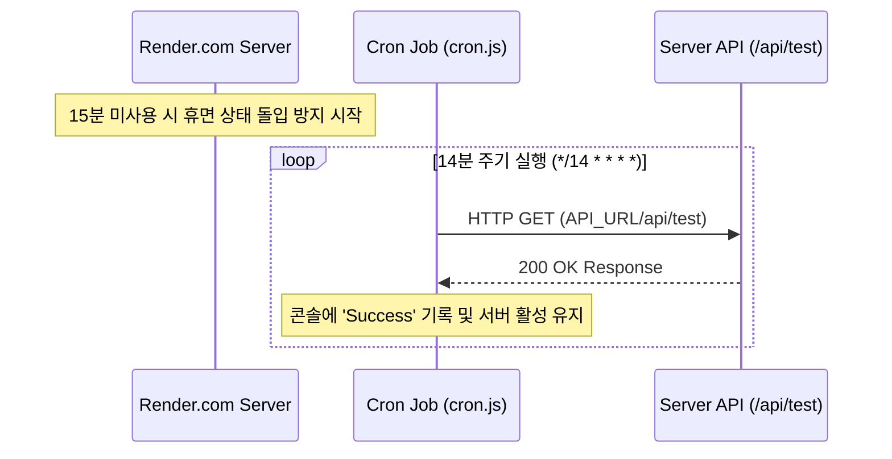

# Render.com 무료 플랜 서버 휴면(Spin-down) 방지 설정 가이드

이 문서는 **Render.com** 무료 플랜에서 제공하는 웹 서비스의 자동 휴면(15분간 요청이 없을 시 서버 중지) 현상을 방지하기 위해, **cron** 라이브러리를 사용하여 14분마다 백엔드 서버가 자기 자신에게 신호(Self-Ping)를 보내도록 설정하는 전체 과정을 설명합니다.

---

## ⚙️ 작동 원리 및 흐름

Render.com의 무료 플랜은 인바운드 트래픽이 15분 동안 없을 경우 서버가 일시 중지(Sleep)됩니다. 휴면 상태에서 첫 요청이 들어오면 서버를 다시 띄우는 데(Cold Start) **약 30초~1분 이상 소요**되어 사용자 경험을 해치게 됩니다.

이를 방지하기 위해 백엔드 서버 내부에 주기적인 스케줄러(Cron Job)를 실행하여 **14분마다 자기 자신의 API 엔드포인트로 HTTP GET 요청**을 보내 활성 상태를 유지합니다.



---

## 📦 1단계: 패키지 설치

백엔드 프로젝트 디렉토리(`backend/`)에서 스케줄링을 담당할 `cron` 패키지를 설치합니다.

```bash
# 백엔드 폴더로 이동 후 설치
cd backend
npm install cron
```

> [!NOTE]
> Node.js v18 이상 버전부터는 전역 `fetch` API를 내장하고 있어 별도의 HTTP 클라이언트 라이브러리(axios 등) 없이 Node.js 내장 `https` 모듈이나 `fetch`를 사용하여 가볍게 요청을 보낼 수 있습니다. 본 가이드에서는 내장 `https` 모듈을 사용합니다.

---

## 📁 2단계: 파일 생성 및 설정

프로젝트의 백엔드 파일 구조는 다음과 같습니다:

```text
webMobile-recipe/
 └─ backend/
     ├─ src/
     │   ├─ config/
     │   │   ├─ env.js         # 환경변수 설정 파일
     │   │   └─ cron.js        # [생성] Cron 스케줄러 설정 파일
     │   └─ server.js          # [수정] Express 서버 시작 및 Cron 연동
     ├─ .env                   # [수정] 배포용 API_URL 및 NODE_ENV 추가
     └─ package.json
```

### 1. `backend/src/config/cron.js` 생성
14분 간격(`*/14 * * * *`)으로 지정된 URL에 HTTP GET 요청을 보내는 Cron 작업을 정의합니다.

```javascript
import cron from "cron";
import https from "https";

// 14분마다 실행되는 크론 잡 정의
const job = new cron.CronJob("*/14 * * * *", () => {
  // 환경변수에 저장된 API_URL로 요청을 보냅니다.
  const targetUrl = process.env.API_URL;
  
  if (!targetUrl) {
    console.log("[Keep-Alive Cron] API_URL 환경 변수가 설정되지 않아 핑을 보낼 수 없습니다.");
    return;
  }

  console.log(`[Keep-Alive Cron] Ping 보냄: ${targetUrl}`);

  https
    .get(targetUrl, (res) => {
      if (res.statusCode === 200) {
        console.log("[Keep-Alive Cron] Success: 서버가 활성 상태입니다.");
      } else {
        console.log(`[Keep-Alive Cron] Warning: 응답 코드 ${res.statusCode}`);
      }
    })
    .on("error", (err) => {
      console.log("[Keep-Alive Cron] Error: " + err.message);
    });
});

export default job;
```

---

### 2. `backend/src/server.js` 연동
개발 환경(`development`)이 아닌 프로덕션 배포 환경(`production`)에서만 크론 잡이 실행되도록 구성합니다. 로컬 개발 단계에서 크론 잡이 돌며 불필요하게 요청을 보내는 것을 방지합니다.

```javascript
import { ENV } from "./config/env.js";
const PORT = ENV.PORT;

import express from "express";
const app = express();
app.use(express.json());

import cors from "cors";
app.use(cors());

// Render.com Keep-Alive Cronjob 연동
import job from "./config/cron.js";
// 프로덕션 환경(배포 서버)에서만 Cron Job을 시작합니다.
if (ENV.NODE_ENV === "production") {
  job.start();
  console.log("[System] Production 환경 감지: Keep-Alive Cron Job 시작됨.");
}

// 핑을 수신하여 200 OK를 리턴할 간단한 테스트 라우트
app.use("/api/test", (req, res) => {
  res.send("OK");
});

// 기타 라우트 설정
import favoriteRoute from "./routes/favorite.route.js";
app.use("/api/favorites", favoriteRoute);

app.listen(PORT, () => {
  console.log(`Server running on port ${PORT}`);
});
```

---

## 🔒 3단계: 환경 변수 설정

크론 잡이 자기 자신을 찾을 수 있도록 환경 변수를 설정해야 합니다.

### 1. 로컬 환경 (`backend/.env`)
로컬 테스트가 필요한 경우 다음과 같이 지정할 수 있으나, 일반적으로 개발 환경에서는 `NODE_ENV=development`로 두어 크론을 꺼두는 것을 권장합니다.

```env
NODE_ENV=development
PORT=5000
# 배포할 경우의 API URL 예시
API_URL=http://localhost:5000/api/test
```

### 2. Render.com 대시보드 설정 (중요)
Render.com에 배포된 서비스의 대시보드로 이동한 후, **Environment** 탭에서 아래의 두 환경 변수를 설정합니다.

| Key | Value | 설명 |
| :--- | :--- | :--- |
| `NODE_ENV` | `production` | 프로덕션 환경임을 지정하여 크론을 작동시킵니다. |
| `API_URL` | `https://your-service-name.onrender.com/api/test` | 배포 완료 후 Render가 부여한 웹 서버 주소 뒤에 테스트 라우트 경로(`/api/test`)를 명시합니다. |

---

## ⚠️ 주의사항 및 팁

1. **무료 사용 시간 한도 (Free Instance Usage Limits)**
   - Render.com 무료 플랜은 계정당 월 **750시간**의 무료 웹 서비스 실행 시간을 제공합니다. 
   - 1개월(30일)은 **720시간**이므로, **단 하나의 무료 웹 서비스만 상시 실행(24/7)**하는 경우에는 한도 초과 없이 완전 무료로 상시 활성화 상태를 유지할 수 있습니다.
   - 만약 계정 내에 여러 개의 무료 웹 서비스를 띄우고 모두 이 크론을 적용해 켜두는 경우, 무료 사용 시간 한도(750시간)가 도중에 소진되어 모든 서비스가 월말까지 중지될 수 있으므로 주의해야 합니다.
2. **콘솔 로그 모니터링**
   - 배포 후 Render 대시보드의 **Logs** 탭에서 14분마다 `[Keep-Alive Cron] Ping 보냄` 로그와 `Success: 서버가 활성 상태입니다.` 로그가 올바르게 찍히는지 모니터링하여 정상 작동 여부를 확인할 수 있습니다.
